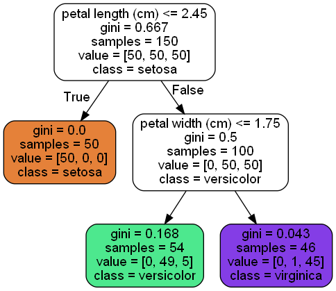
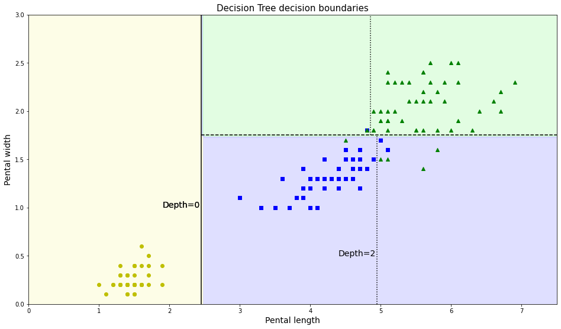
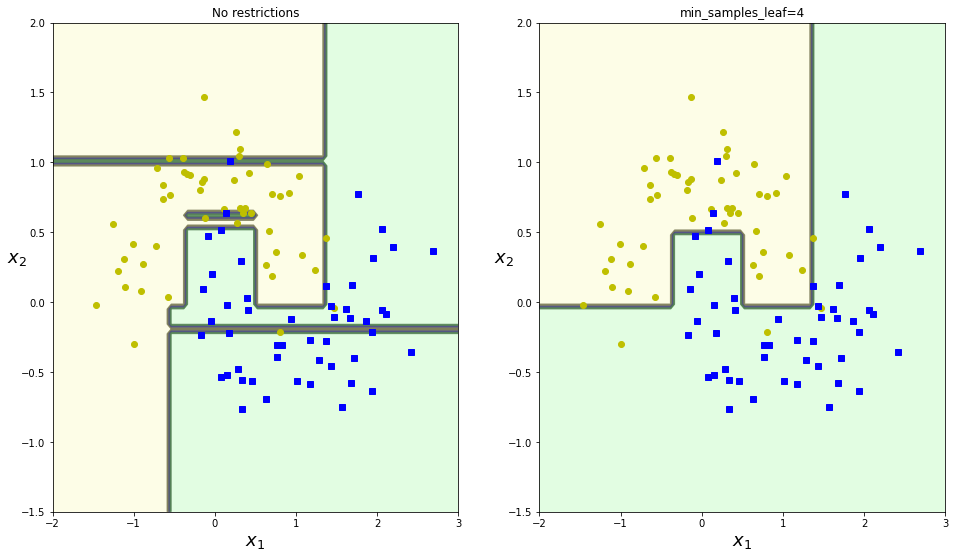

# 决策树

- 有监督学习

- 树的组成：

  - 根节点：第一个选择点
  - 非叶子节点与分支：中间过程
  - 叶子节点：最终的决策结果

- 特征切分的衡量标准：熵

  $\textcolor{Red}{表示随机变量不确定性的度量,不确定性越大，得到的熵越大}$ 
  $$
  H(x)=-\sum p(i)\cdot log\ p(i),\ i=1,2,\cdots,n
  $$

- 信息增益：表示特征 X 使得类别 Y 的不确定性减少的程度。（分类后的专一性，希望分类后的结果是同类在一起）

- GINI 系数：
  $$
  Gini(p)=\sum_{k=1}^{K}p_k(1-p_k)=1-\sum_{k=1}^{K}p_k^2
  $$

- 剪枝策略：

  - 决策树过拟合风险很大，理论上可以完全分得开数据
  - 预剪枝：边建立决策树边进行剪枝（更实用），限制树的深度，叶子节点个数，叶子节点的样本数，信息增益等方法
  - 后剪枝：当建立完决策树后再进行剪枝操作，通过一定的衡量标准 $C_\alpha(T)=C(T)+\alpha\cdot|T_{leaf}|$ （叶子节点越多，损失越大）

## 实验

- 鸢尾花数据集建立的决策树模型：

  

  根据衡量标准Gini系数进行根节点与叶子节点的选取，其决策边界如下图：

  

  

- 限制条件，防止过拟合

  

  