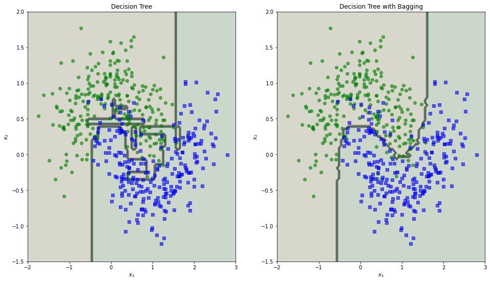
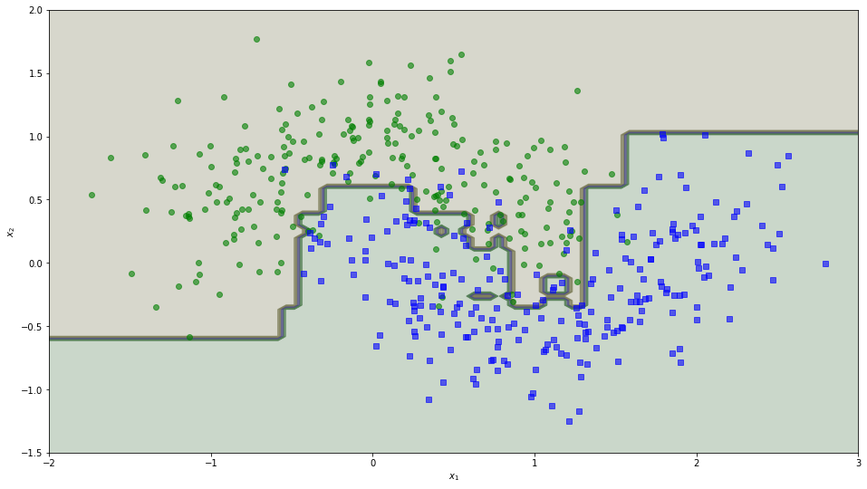
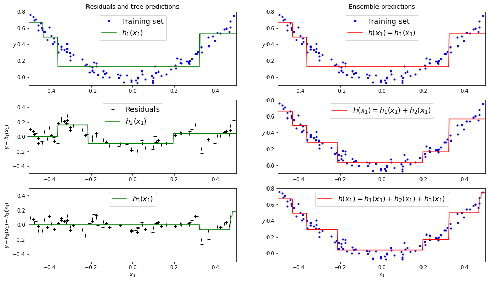
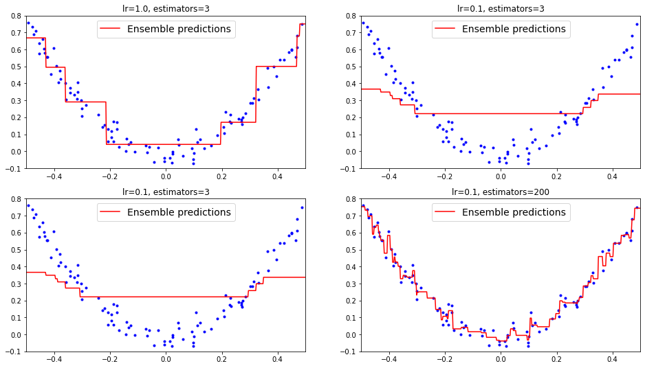
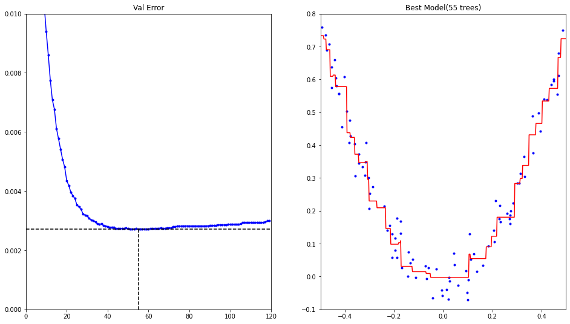

# 2022 年 10 月第 7 周学习汇总——宋世淼

## 集成算法

- 目的：让学习效果更好
- **Bagging**：训练多个分类器取平均 $f(x)=\frac{1}{M}\sum_{m=1}^{M}f_m(x)$ 
- **Boosting**：从弱学习器开始加强，通过加权来进行训练 $F_m(x)=F_{m-1}(x)+argmin_h\sum_{i=1}^{n}L(y_i,F_{m-1}(x_i))+h(x_i)$ (加入一颗树，要比原来强)
- **Stacking** ：聚合多个分类或回归模型（可以分阶段来做）
- 集成基本思想：
  - 训练时用多种分类器一起完成同一份任务
  - 测试时对待测样本分别通过不同的分类器，汇总最后的结果

## 实验

- **投票策略：硬投票与软投票**

  - 硬投票：直接用类别值，少数服从多数

  - 软投票：各自分类器的概率值进行加权平均（要求必须各个分类器都能得出概率值）

  - 实验结果：

    分类器选择逻辑回归(**LR**)，随机森林(**RF**)，支持向量机(**SVM**)，以及三者集成

    |          |  LR   |  RF   |  SVM  | Voting(Hard) | Voting(Soft) |
    | :------: | :---: | :---: | :---: | :----------: | :----------: |
    | Accuracy | 0.864 | 0.896 | 0.896 |    0.912     |    0.920     |

- **Bagging 策略**

  - 首先对训练数据集进行多次采样，保证每次得到的采样数据都是不同的

  - 分别训练多个模型，例如树模型

  - 预测时需得到所有模型结果再进行集成

  - 实验结果：

    选择单个决策树模型(**DecisionTree**)，以及多个树模型集成

    |          | DecisionTree | Bagging(DecisionTree) |
    | :------: | :----------: | :-------------------: |
    | Accuracy |    0.856     |         0.904         |

  - 决策边界

    

- **随机森林**

  - 特征重要性：对于分类任务，数据集的各个特征对分类结果的影响比重

  - 鸢尾花数据集特征重要性

    |            | sepal length (cm) | sepal width (cm) | petal length (cm) | pental width (cm) |
    | :--------: | :---------------: | :--------------: | :---------------: | :---------------: |
    | Importance |       0.108       |      0.022       |       0.436       |       0.434       |

  - Mnist 数据集特征重要性热度图

    

- **Boosting 提升策略**

  - AdaBoost

    

  - Gradient Boosting 梯度提升策略

    

    不同参数对训练的影响

    

- **提前停止策略**

  - 训练次数越多，效果不一定越好，找到效果最好的那次，提前停止

    

