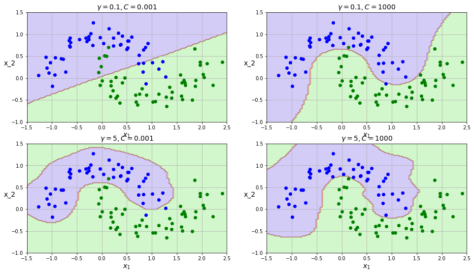

# 2022年10月第8周学习汇总——宋世淼

## SVM 支持向量机

- 二分类
- 决策边界：选出离“雷区”最远的点（边界上的点，要 Large Margin）
- 优化的目标：
  - 找到一条线（w 和 b），使得离该线最近的点能够最远
- soft-margin
  - 软间隔：有时候数据中有一些噪音点，如果考虑它们分类会变困难
  - 松弛因子 $y_i(w\cdot x_i+b)\ge 1-\xi_i$ 
  - 新目标函数：$min\frac{1}{2}||w||^2+C\sum_{i=1}^{n}\xi_i$ 
  - 当$C$ 趋近于很大时：意味着分类严格不能有错误
  - 当 $C$ 趋近于很小时：意味着可以有更大得错误容忍
  - $C$ 时需要指定的参数（超参数）
- 低维不可分问题
  - 核变换：低维时不可分，将数据映射到高维
  - 目标：找到一种变换方法，也就是 $\Phi(X)$ 
  - 高斯核函数：$K(X,Y)=exp\left\{-\frac{||X-Y||^2}{2\sigma^2}\right\}$ 

## 实验

- 软间隔：使用超参数 $C$ 控制软间隔程度

  - 对比不同 $C$ 值所带来的效果差异
  - 使用较低的 $C$ 值，间隔要大得多，但很多样本最终会出现在间隔之内
  - 使用较高的 $C$ 值，分类器会减少误分类，但最终会有较小的间隔

  

- 非线性SVM

  - 数据升维

  

  - 使用多项式方法

  

  - 高斯核函数
    - 利用相似度来变换特征
    - 选择一份一维数据， 并在 $x_1=-2$ 和 $x_1=1$ 处为其添加两个高斯函数
    - 将相似度函数定义为 $\gamma=0.3$ 的径向基函数 （RBF）$$\phi\gamma(x,\ell)=exp(-\gamma||x-\ell||^2)$$
      例如： $x_1=-1$ 位于距第一个地表距离为 $1$ 的地方，距第二个地表距离为 $2$。因此，其新特征是 $x_2=exp(-0.3\times1^2)\approx0.74$ 并且 $x_3=exp(-0.3\times2^2)\approx0.30$。

    - 增加 $\gamma$ 使高斯曲线变窄，因此每个实例的影响范围都较小，决策边界最终变得更不规则，过拟合风险增大
    - 减少 $\gamma$ 使高斯曲线变宽，因此实例具有更大的影响范围，并且决策边界更加平滑

  

  $\gamma$ 越大，过拟合风险越大