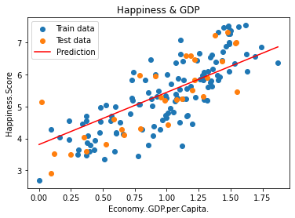
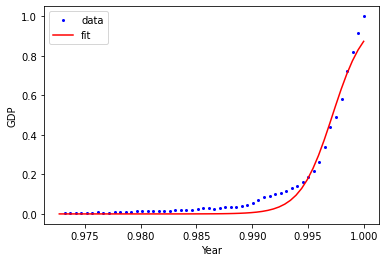

# 2022年9月第二周第三周学习汇总——宋世淼

[学习笔记.md](学习笔记.md)

## 一、线性回归

- 1.1 原理
- 1.2 所做实验代码

### 1.1 原理

**直接求解**：
$$
J(\theta) = \frac{1}{2}\sum_{i=1}^{m}(h_\theta(x^{(i)})-y^{(i)})^2 = \frac{1}{2}(X\theta-y)^T(X\theta-y)
$$
另偏导等于0：
$$
\theta = (X^TX)^{-1}X^Ty
$$
**机器学习优化的思想**：

- 批量梯度下降：容易得到最优解，但是由于每次考虑所有样本，速度慢。
  $$
  \frac{\partial J(\theta)}{\partial \theta_j} = -\frac{1}{m}\sum_{i=1}^{m}(y^i-h_\theta(x^i))x_j^i\theta_j^\prime = \theta_j+\frac{1}{m}\sum_{i=1}^{m}(y^i-h_\theta(x^i))x_j^i
  $$

- 随机梯度下降(SGD)：每次找一个样本，迭代速度快，但不一定每次都朝着收敛方向。
  $$
  \theta_j^\prime = \theta_j + (y^i-h_\theta(x^i))x_j^i
  $$

- 小批量梯度下降(MiniBatch)：每次更新选择一小部分数据来算。
  $$
  \theta_j := \theta_j - \alpha\frac{1}{10}\sum_{k=i}^{i+9}(h_\theta(x^{(k)})-y^{(k)})x_j^{(k)}
  $$

### 1.2 实验代码

- [单变量线性回归实验 UnivariateLinearRegression.ipynb](LinearRegression/UnivariateLinearRegression.ipynb)

  

  

- [多特征线性回归实验 MultivariateLinearRegression.ipynb](LinearRegression/MultivariateLinearRegression.ipynb)

- [非线性回归实验 Non_linearRegression.ipynb](LinearRegression/Non_linearRegression.ipynb)

- [线性回归实验 LinearRegressionExperiment.ipynb](LinearRegression/LinearRegressionExperiment.ipynb)

  该实验做了对比实验，主要有：

  - **不同学习率(learning rate)对训练结果的影响**：

    

    可以看出，$lr$ 越小，拟合效果越好（训练时间会越长）。

  - **不同梯度下降策略的对比实验**：

    

    可以看出批量梯度下降效果最好（容易得到最优解，但用时长）；SGD不是每次都朝着收敛的方向下降（抖动最严重）；小批量梯度下降可以看出明显的折线（每次更新选择一小部分数据）。

  - **多项式回归实验**：

    将原始数据转换成更高维的数据进行训练，对比不同多项式最大特征次数的拟合情况

    

    可以看出，多项式次数越高，拟合力度越大，模型会越容易过拟合。

  - **正则化实验**：

    对训练数据加上一个惩罚项，来预防模型过拟合。惩罚因子一般有 ：

    - $L_1$ 范数：$\sum_i|\theta_i|$ 
    - $L_2$ 范数：$(\sum_i\theta_i^2)^\frac{1}{2}$ 

    还有一个重要的参数 $\alpha$ 来表示惩罚的力度。

    

    

    上图分别为用 $L_1$ 与 $L_2$ 惩罚因子所做的图，可以看出 $\alpha$ 越大，曲线越平滑，对过拟合的抑制能力就越强。