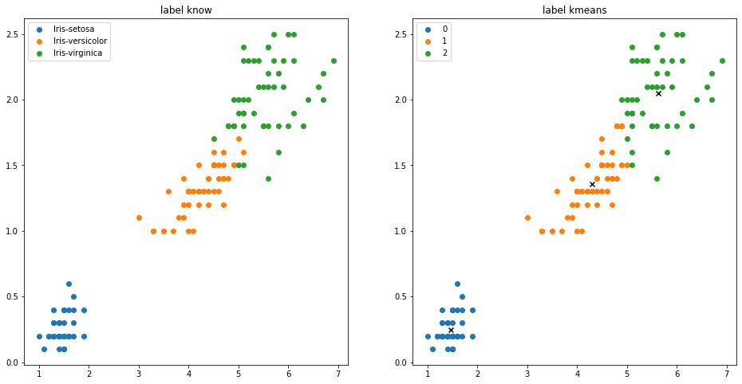
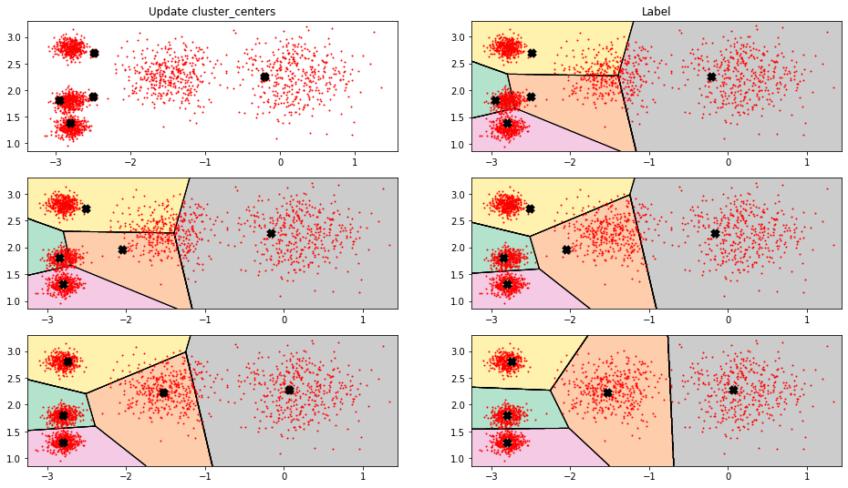
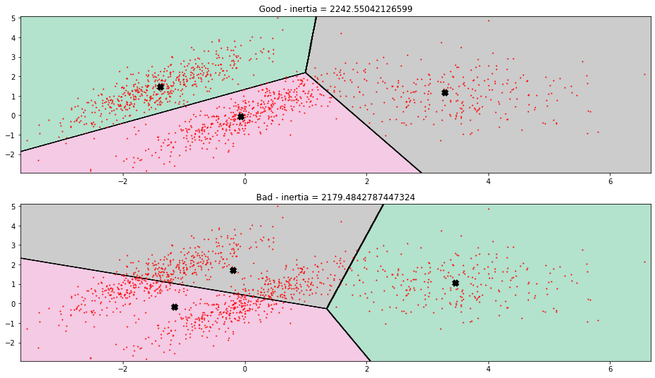
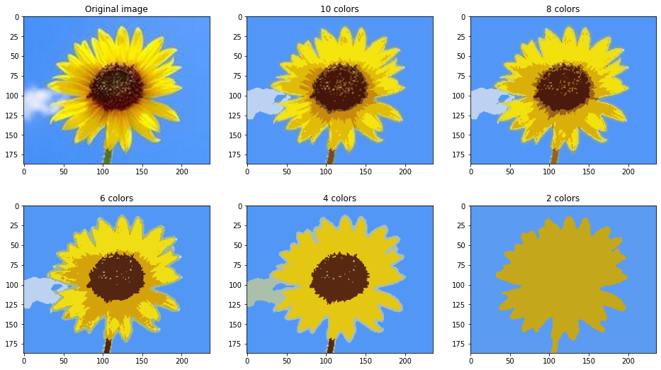
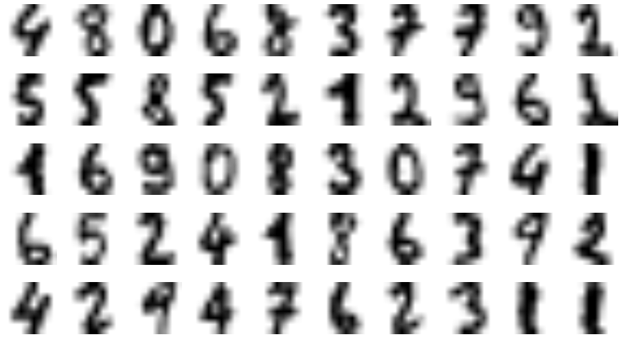

# 2022年9月第五周学习汇总——宋世淼

## 聚类

- 无监督问题
- 相似的东西分到一起
- 如何评估，如何调参


### KMEANS

- 聚类簇的个数 K
- “一种不断更新类簇的质心的过程”
- 距离度量：**欧式距离**，**余弦相似度**
- 优势：
  - 简单，快速，适合常规数据集
- 劣势：
  - 簇的数量 K 很难确定，K值不同，初始化质点位置不同对结果影响非常大
  - 很难发现任意形状的簇


### DBSCAN

- 一种**“传销式”**发展下线的算法
- 指定**半径**与**密度阈值**
- 优势：
  - 擅长**异常检测**任务，找**离群点**
  - 可以发现任意形状的簇
- 劣势：
  - 凋参困难，效率低


### 实验

#### 分类与聚类的对比




#### KMEANS 分步理解




#### KMEANS 评估方法

- Inertia 指标：每个样本与其质心的距离

- 存在的问题：评估指标好的，其结果不一定是合适的

  

  第二张图片评估指标更好，但其聚类结果不是正确结果


#### 图像分割

对一张RGB图片，根据其颜色进行分割，以实现前景提取




#### 半监督学习

一个数据集只有一部分是带标签的数据。

假设将训练集聚类为50个集群，对于每个聚类，找到最靠近质心的样本，将该样本作为该类代表性样本。

- 对比实验：
  - 选取50个有标签的样本，进行有监督学习
  - 对所有样本进行无监督学习，50个集群（K=50），找到每个簇中距离最近的将它们定义为代表性样本，再对代表性样本（50个）进行手动标定，之后进行有监督学习
  - 将代表性样本的标签传播到同一集群中的所有其他实例。


|        | 模型测试结果 |
| :----: | :----------: |
| 实验一 |    0.8267    |
| 实验二 |    0.9200    |
| 实验三 |    0.9289    |




手动标定：

```python
y_representative_digits = np.array([
    4, 8, 0, 6, 8, 3, 7, 7, 9, 2,
    5, 5, 8, 5, 2, 1, 2, 9, 6, 1,
    1, 6, 9, 0, 8, 3, 0, 7, 4, 1,
    6, 5, 2, 4, 1, 8, 6, 3, 9, 2,
    4, 2, 9, 4, 7, 6, 2, 3, 1, 1
])
```

