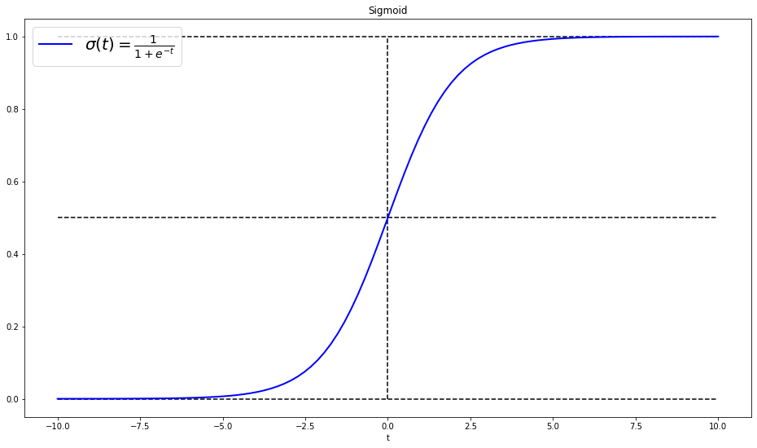
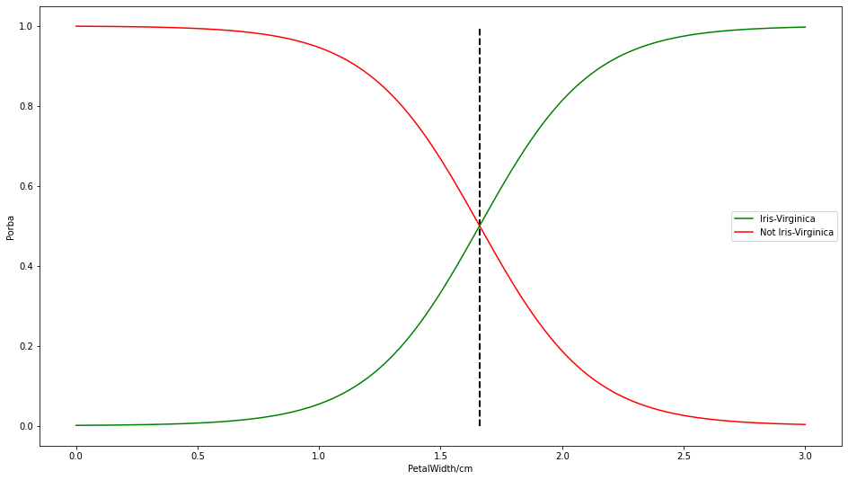
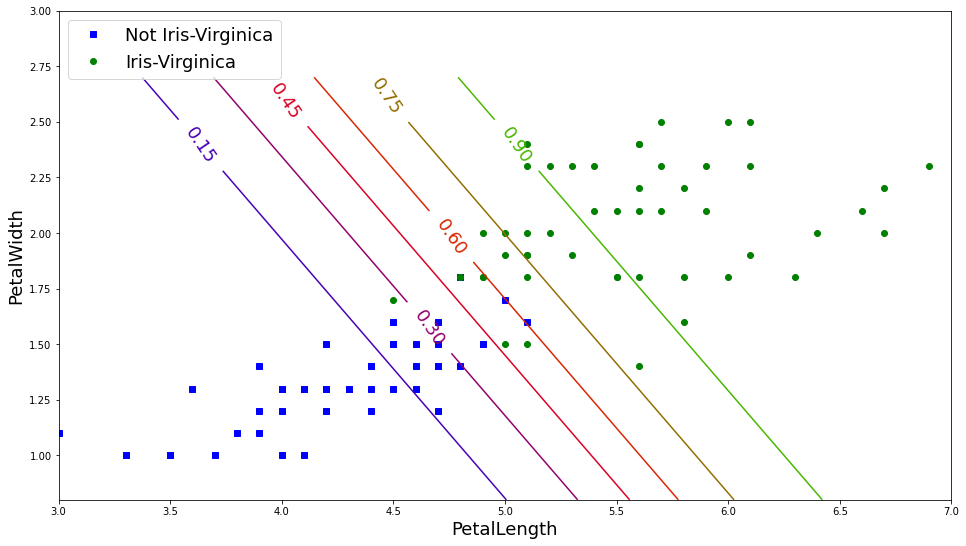
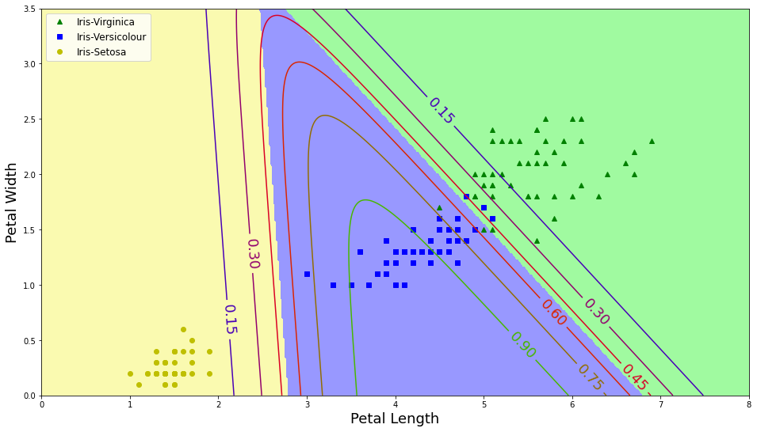

# 2022年9月第四周学习汇总——宋世淼

## 逻辑回归

是一种经典的二分类算法

### 原理：

$$
\begin{cases}P(y=1|x;\theta)=h_\theta(x)\\P(y=0|x;\theta)=1-h_\theta(x)\end{cases}
$$

$$
\Rightarrow P(y|x;\theta)=\left[h_\theta(x)\right]^y\left[1-h_\theta(x)\right]^{1-y}\tag{*}
$$

二分类任务(0, 1)，(*)式说明，y 取 0 时保留后一项，取 1 时保留前一项。

### 逻辑回归实验

- **所用数据集为鸢尾花数据集**
  - 样本数量：150 （每类样本 50， 共 3 类）
  - 特征数量：4
  - 特征类型：
    - sepal length in cm
    - sepal width in cm
    - petal length in cm
    - petal width in cm
  - 类：
    - Iris-Setose
    - Iris-Versicolour
    - Iris-Virginica

- **Sigmoid 函数**

  
  $$
  \sigma(t)=\frac{1}{1+e^{-t}}
  $$

- **逻辑回归推导公式**

  类别定义：
  $$
  \hat{y}=\begin{cases}0\ if\ \hat{p}< 0.5,\\1\ if\ \hat{p}\ge0.5.\end{cases}  
  $$

  $$
   c(\theta)=\begin{cases}-log(\hat{p})\ if\ y=1,\\-log(1-\hat{p})\ if\ y=0.\end{cases}
  $$

  损失函数：
  $$
  J(\theta)=-\frac{1}{m}\sum_{i=1}^{m}\left [y^{(i)}log(\hat{p}^{(i)})+(1-y^{(i)})log(1-\hat{p}^{(i)})\right]
  $$
  梯度计算：
  $$
  \frac{\partial}{\partial\theta_j}J(\theta)=\frac{1}{m}\sum_{i=1}^{m}\left[\sigma(\theta^T\cdot x^{(i)})-y^{(i)}\right]x_j^{(i)}
  $$

#### 二分类任务实验

- 选择 **Petal width** 特征数据作为训练数据 **X**

  |                 | Min  | Max  | Mean |
  | :-------------: | :--: | :--: | :--: |
  | petal width(cm) | 0.1  | 2.5  | 1.2  |

- 定义标签 **y**:

  - Iris-Virginica : y = 1 (petal width 范围为 1.4~2.5 cm)
  - Not Iris-Virginica : y = 0

上图显示出随着 petal width 长度的增加，被判定为 Iris-Virginica 类的概率增加，被判定为 Not Iris-Virginica 类的概率减少，交点处的概率为 0.5

#### 二分类任务的决策边界

- 选择 **Petal Length & Petal Width** 作为训练数据 **X**

  |                  | Min  | Max  | Mean |
  | :--------------: | :--: | :--: | :--: |
  | petal length(cm) | 1.0  | 6.9  | 3.76 |

#### 多分类任务实验

- 归一化指数函数 **Softmax**：
  $$
  \hat{p_k}=\sigma(s(X))_k=\frac{exp(s_k(X))}{\sum_{j=1}^{K}exp(s_j(X))}
  $$
  将概率值放进指数函数内，放大数据差异，再做归一化操作

- **交叉熵**：

  度量两个概率分布间的差异性信息。
  $$
  J(\Theta)=-\frac{1}{m}\sum_{i=1}^{m}\sum_{k=1}^{K}y_k^{(i)}log(\hat{p}_k^{(i)})
  $$

#### 多分类任务的决策边界

