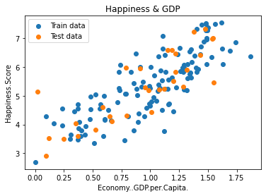
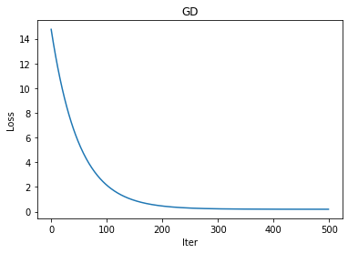
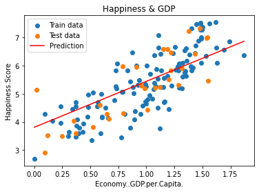
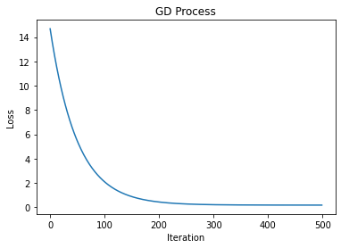
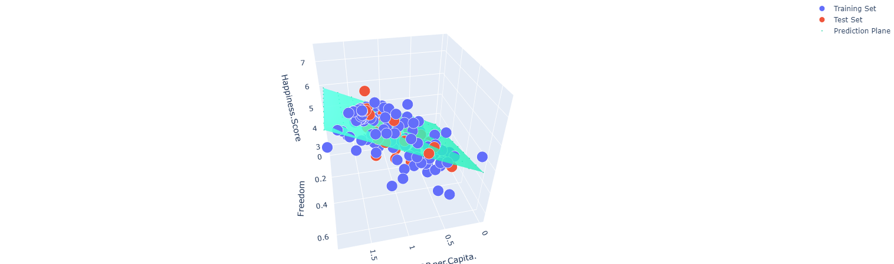
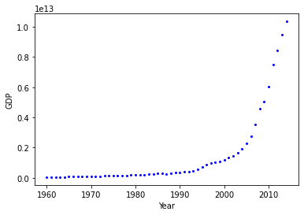
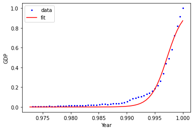
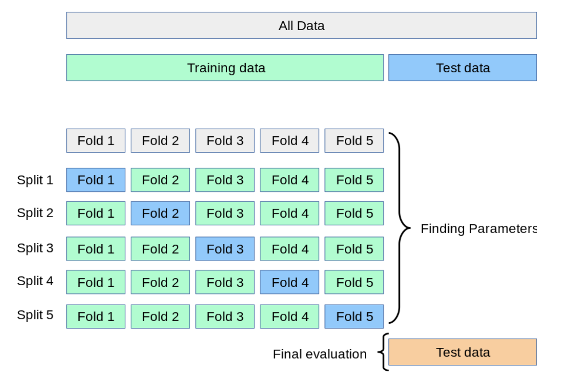

机器学习经典算法学习笔记

##  第一章 线性回归

### 1.1 原理

线性回归为**有监督算法（需要标签）**。

假设 $\theta_1$ 是 $x_1$ 的参数，$\theta_2$ 是 $x_2$ 的参数

拟合的平面： $h_\theta(x)=\theta_0+\theta_{1} x_1+\theta_2 x_2$ 

**整合**：
$$
h_\theta(x)=\sum_{i=0}^{n}\theta_i x_i=\theta^Tx
$$

**误差**：

真实值和预测值之间 存在的差异（$\varepsilon$)

对于每个样本：
$$
y^{(i)}=\theta^Tx^{(i)}+\varepsilon^{(i)}\tag{1}
$$
​                                                  

**误差 $\varepsilon^{(i)}$  是独立同分布，是服从均值为 0 方差为 $\theta^2$ 的高斯分布 **（机器学习的基础）

由于误差服从高斯分布：
$$
p(\varepsilon^{(i)})=\frac{1}{\sqrt{2\pi}\sigma}exp(-\frac{(\varepsilon^{(i)})^2}{2\sigma^2})\tag{2}
$$
将（1）式带入（2）式：
$$
p(y^{(i)}|x^{(i)};\theta)=\frac{1}{\sqrt{2\pi}\sigma}exp(-\frac{(y^{(i)}-\theta^Tx^{(i)})^2}{2\sigma^2})
$$
求得 $(x,\theta)$ 与 $y$ 越接近越好！

**似然函数**：
$$
L(\theta) = \prod_{i=1}^{m}p(y^{(i)}|x^{(i)};\theta) = \prod_{i=1}^{m}\frac{1}{\sqrt{2\pi}\sigma}exp(-\frac{(y^{(i)}-\theta^Tx^{(i)})^2}{2\sigma^2})
$$
**对数似然**：
$$
log\prod_{i=1}^{m}\frac{1}{\sqrt{2\pi}\sigma}exp(-\frac{(y^{(i)}-\theta^Tx^{(i)})^2}{2\sigma^2})
$$
展开化简：
$$
\sum_{i=1}^{m}log\frac{1}{\sqrt{2\pi}\sigma}exp(-\frac{(y^{(i)}-\theta^T x^{(i)})^2}{2\sigma^2})\\
= m\cdot log\frac{1}{\sqrt{2\pi}\sigma}-\frac{1}{2\sigma^2}\sum_{i=1}^{m}(y^{(i)}-\theta^Tx^{(i)})^2
$$
目标：是让似然函数越大越好

最小二乘法：
$$
J(\theta) = \frac{1}{2}\sum_{i=1}^{m}(y^{(i)}-\theta^Tx^{(i)})^2
$$
目标：让$J(\theta)$ 越小越好！（目标函数，损失函数 Loss Function）

**目标函数求解**

目标函数：
$$
J(\theta) = \frac{1}{2}\sum_{i=1}^{m}(h_\theta(x^{(i)})-y^{(i)})^2 = \frac{1}{2}(X\theta-y)^T(X\theta-y)
$$
求偏导：
$$
\bigtriangledown_\theta J(\theta)=\bigtriangledown_\theta(\frac{1}{2}(X\theta-y)^T(X\theta-y)\\ =\bigtriangledown_\theta(\frac{1}{2}(\theta^TX^T-y^T)(X\theta-y))\\ =\bigtriangledown_\theta(\frac{1}{2}(\theta^TX^TX\theta-\theta^TX^Ty-y^TX\theta+y^Ty))\\ =\frac{1}{2}(2X^TX\theta-X^Ty-(y^TX)^T)=X^TX\theta-X^Ty
$$
偏导等于0：
$$
\theta = (X^TX)^{-1}X^Ty
$$

**梯度下降**

寻找目标函数的“终点”（什么样的参数能使目标函数达到极值点） 

目标函数：
$$
J(\theta) = \frac{1}{2m}\sum_{i=1}^{m}(y^i-h_\theta(x^i))^2
$$
**批量梯度下降**：
$$
\frac{\partial J(\theta)}{\partial \theta_j} = -\frac{1}{m}\sum_{i=1}^{m}(y^i-h_\theta(x^i))x_j^i\theta_j^\prime = \theta_j+\frac{1}{m}\sum_{i=1}^{m}(y^i-h_\theta(x^i))x_j^i
$$
(容易得到最优解，但是由于每次考虑所有样本，速度很慢)

**随机梯度下降(SGD)**：
$$
\theta_j^\prime = \theta_j + (y^i-h_\theta(x^i))x_j^i
$$
（每次找一个样本，迭代速度快，但不一定每次都朝着收敛方向）

**小批量梯度下降法（mini batch）**：
$$
\theta_j := \theta_j - \alpha\frac{1}{10}\sum_{k=i}^{i+9}(h_\theta(x^{(k)})-y^{(k)})x_j^{(k)}
$$
(每次更新选择一小部分数据来算，实用！)

**学习率（步长）learning rate**：对结果产生巨大的影响，一般小一些

### 1.2 代码实现

#### 1.2.1 模块编写

**归一化模块**

[normalize.py](LinearRegression/normalize.py)

计算特征（输入）的均值feature_mean，标准差feature_deviation。

归一化操作：
$$
features\_normalized = \frac{x-\mu}{\sigma}
$$
返回归一化后的特征，均值，标准差

**训练前要做的准备**

[prepare_for_traning.py](LinearRegression/prepare_for_training.py)

- 计算样本总数
- 预处理（调用normalize模块）
- 返回处理后的数据，均值，标准差

**定义线性回归类**

[linear_regression.py](LinearRegression/linear_regression.py)

#### 1.2.2 单变量线性回归实现

[源码](LinearRegression/UnivariateLinearRegression.ipynb)

使用的数据为[world_happiness_report2017.csv](LinearRegression/data/world_happiness_report2017.csv)

**目的**：训练出GDP与幸福指数之间的线性回归方程

导入数据：

```python
data = pd.read_csv('data/world_happiness_report2017.csv')
train_data = data.sample(frac=0.8)
test_data = data.drop(train_data.index)
input_param_name = 'Economy..GDP.per.Capita.'
output_param_name = 'Happiness.Score'
x_train = train_data[[input_param_name]].values
y_train = train_data[[output_param_name]].values
x_test = test_data[[input_param_name]].values
y_test = test_data[[output_param_name]].values
```

导入后显示：



训练模型：

```python
num_iterations = 500
lr = 0.01
linear_regression = LinearRegression(x_train, y_train)
(theta, loss_history) = linear_regression.train(lr, num_iterations)
```

梯度下降：



测试及回归结果：

```python
preditions_num = 100
x_predictions = np.linspace(x_train.min(), x_train.max(), preditions_num).reshape(preditions_num, 1)
y_predictions = linear_regression.predict(x_predictions)
```



#### 1.2.3 多特征建立线性回归模型

[源码](LinearRegression/MultivariateLinearRegression.ipynb)

使用的数据为[world_happiness_report2017.csv](LinearRegression/data/world_happiness_report2017.csv)

**目的**：训练出GDP，Freedom与幸福指数的线性回归模型

核心代码：

```python
linear_regression = LinearRegression(x_train, y_train, polynomial_degree, sinusoid_degree)
(theta, loss_history) = linear_regression.train(lr, num_iterations)
```







#### 1.2.4 非线性回归模型

[源码](LinearRegression/Non_linearRegression.ipynb)

使用的数据为[china_gdp.csv](LinearRegression/data/china_gdp.csv)

导入数据：



使用 $sigmoid$ 函数进行拟合：
$$
Y=\frac{1}{1+e^{\beta_1(X-\beta_2)}}
$$





## 第二章 模型评估方法

[notebook](ModelEvaluationMethods/model_evaluation_methods.ipynb)


### 2.1 交叉验证

交叉验证（循环估计），是一种统计学上将数据样本切分成较小子集的实用方法。将数据集切分为训练集和测试集(test data)，其中在训练集内再切分为训练集(train date)和验证集(validation data)。交叉验证的目的，是用未训练过的新数据测试模型的性能，以便减少诸如过拟合和选择偏差等问题。


#### 2.1.1 LOOCV

LOOCV(Leave-one-out-cross-validation)方法是只用一个数据作为验证集，其他数据都作为训练集，并将此步骤重复N次（N为数据集的数据数量）。

假设现在有n个数据组成的数据集，那么LOOCV方法就是每次取出一个数据作为验证集的唯一元素，而其他n-1个数据都作为训练集用于训练模型和调参。结果就是我们最终训练了n个模型，每次都能得到一个MSE。
$$
CV_{(n)}=\frac{1}{n}\sum_{i=1}^{n}MSE_i
$$

#### 2.1.2 K-fold Cross Validation

K折交叉验证，每次的验证集不再只包含一个数据，具体数目将根据k的选取决定。比如K=5：

- 将所有的训练集分成5份
- 不重复地每次取其中一份做为验证集，用其他四份做训练集训练模型，之后计算该模型在验证集上的$MSE_i$ 
- 将5次的 $MSE_i$ 取平均





$$
CV_{(k)}=\frac{1}{k}\sum_{i=1}^{k}MSE_i
$$


不难理解，LOOCV是一种特殊的K-fold Cross Validation(K=N)。


#### 2.1.3 Bias-Variance Trade-Off for K-Fold Cross-Validation

对于K的选取。K越大，每次投入的训练集的数据就越多，模型的偏移越小；但是K越大，又意味着每次选取的训练集之间的相关性越大，而这种相关性会导致结果有更大的方差。一般来说，根据经验，选择K=5或者10。


#### 2.1.4 Cross-Validation on Classification Problems

对于分类问题，可以用下式衡量：
$$
CV_{(n)}=\frac{1}{n}\sum_{i=1}^{n}Err_i
$$


其中 $Err_i$ 表示第 $i$ 个模型在第 $i$ 组验证集上的分类错误的个数。


### 2.2 Confusion Matrix 混淆矩阵

|         二分类问题          |      相关（Relevant），正类       |     无关（NonRelevant），负类     |
| :-------------------------: | :-------------------------------: | :-------------------------------: |
|    被检索到（Retrieved）    |  true positive(TP 正类判定为正)   | false positive(FP 负类判定为正类) |
| 未被检索到（Not Retrieved） | false negative(FN 正类判定为负类) | true negative(TN 负类判定为负类)  |


#### 2.2.1 准确率

$$
accuracy=\frac{TP+TN}{TP+TN+FP+FN}=\frac{TP+TN}{all\ data}
$$


在数据集不平衡时，准确率将不能很好的表示模型的性能。可能会存在准确率很高，而少数类样本全分错的情况，此时应该选择其他模型评价指标。


#### 2.2.2 Precision & Recall

$$
precision=\frac{TP}{TP+FP}
$$

表示在预测为 positive 的样本中真实类别为 true 的样本所占比例。


$$
recall=\frac{TP}{TP+FN}
$$
表示在真实类别为 true 的样本中模型预测为 positive 的样本所占比例。


#### 2.2.3 $F_1$ score

$$
F_1=\frac{2}{\frac{1}{precision}+\frac{1}{recall}}=\frac{2\cdot precision\cdot recall}{precision+recall}
$$

$F_1$ 值就是 precision 和 recall 的调和平均值。如果召回率和查准率都很高，分类器将获得高 $F_1$ 分数。


#### 2.2.4 ROC curves

recelver operating characteristic (ROC) 曲线是二元分类中的常用评估方法

ROC曲线的纵坐标 TPR 在数值上等于 positive class 的 recall；横坐标 FPR 在数值上等于 （1- negative class 的 recall）：
$$
TPR=\frac{TP}{TP+FN}=recall_{positive}
$$

$$
FPR = \frac{FP}{FP+TN}=\frac{FP+TN-TN}{FP+TN}\\=1-\frac{TN}{FP+TN}=1-recall_{negative}
$$


## 第三章 逻辑回归

- 目的： 经典的二分类算法
- 机器学习算法选择：先逻辑回归再用复杂的，能用简单还是用简单的
- 逻辑回归的决策边界：可以是非线性的

### 3.1 Sigmoid 函数

$$
g(z)=\frac{1}{1+e^{-z}}
$$

- 自变量取值为任意实数，值域[0, 1]

- 将任意的输入映射到了 [0,1] 区间。在线性回归中可以得到一个预测值，再将该值映射到 sigmoid 函数中，这样就完成了由值到概率的转换，也就是分类任务。

- 预测函数：
  $$
  h_\theta(x)=g(\theta^Tx)=\frac{1}{1+e^{-\theta^Tx}}
  $$
  其中
  $$
  \theta_0+\theta_1x_1+,\cdots,+\theta_nx_n=\sum_{i=1}^{n}\theta_ix_i=\theta^Tx
  $$

- 分类任务：
  $$
  P(y=1|x;\theta)=h_\theta(x)
  $$

  $$
  P(y=0|x;\theta)=1-h_\theta(x)
  $$

  $\Rightarrow$  整合：
  $$
  P(y|x;\theta)=(h_\theta(x))^y(1-h_\theta(x))^{1-y}\tag{*}
  $$
  
- 上式中对于二分类任务（0，1），整合后 y 取 0 只保留了后一项，取 1 只保留了前一项。


### 3.2 原理

- (*) 式的似然函数：

$$
L(\theta)=\prod_{i=1}^{m}P(y_i|x_i;\theta)=\prod_{i=1}^{m}(h_\theta(x_i))^{y_i}(1-h_\theta(x_i))^{1-y_i}
$$

- 对数似然：

$$
l(\theta)=logL(\theta)=\sum_{i=1}^{m}(y_ilogh_\theta(x_i)+(1-y_i)log(1-h_\theta(x_i)))
$$
​			目标：似然函数越大越好，应为梯度上升求最大值。

**引入 $J(\theta)=-\frac{1}{m}l(\theta)$  转换为梯度下降任务** 


求导过程：
$$
\frac{\delta}{\delta_{\theta_j}}J(\theta)=-\frac{1}{m}\sum_{i=1}^{m}(y_i\frac{1}{h_\theta(x_i)}\frac{\delta}{\delta_{\theta_j}}h_\theta(x_i)-(1-y_i)\frac{1}{1-h_\theta(x_i)}\frac{\delta}{\delta_{\theta_j}}h_\theta(x_i))\\=-\frac{1}{m}\sum_{i=1}^{m}(y_i\frac{1}{g(\theta^Tx_i)}-(1-y_i)\frac{1}{1-g(\theta^Tx_i)})\frac{\delta}{\delta_{\theta_j}}g(\theta^Tx_i)\\=-\frac{1}{m}\sum_{i=1}^{m}(y_i\frac{1}{g(\theta^Tx_i)}-(1-y_i)\frac{1}{1-g(\theta^Tx_i)})g(\theta^Tx_i)(1-g(\theta^Tx_i))\frac{\delta}{\delta_{\theta_j}}\theta^Tx_i\\=-\frac{1}{m}\sum_{i=1}^{m}(y_i(1-g(\theta^Tx_i))-(1-y_i)g(\theta^Tx_i))x_i^j\\=-\frac{1}{m}(y_i-g(\theta^Tx_i))x_i^j
$$


- 参数更新：
  $$
  \theta_j:=\theta_j-\alpha\frac{1}{m}\sum_{i=1}^{m}(h_\theta(x_i)-y_i)x_i^j
  $$

- 多分类的 softmax:
  $$
  h_\theta(x^{(i)})=\begin{bmatrix}p(y^{(i)}=1|x^{(i)};\theta)\\p(y^{(i)}=2|x^{(i)};\theta)\\\vdots\\p(y^{(i)}=k|x^{(i)};\theta)\end{bmatrix}=\frac{1}{\sum_{j=1}^{k}e^{\theta^T_jx^{(i)}}}\begin{bmatrix}e^{\theta^T_1x^{(i)}}\\e^{\theta^T_2x(i)}\\\vdots\\e^{\theta^T_kx^{(i)}}\end{bmatrix}
  $$
  
